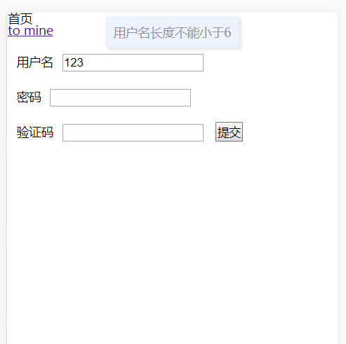
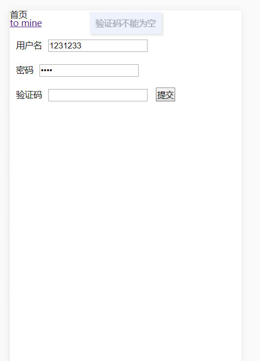

## `Vue-Template`
> 个人[`github`](https://github.com/wangkaiwd)地址：`https://github.com/wangkaiwd`。  
> 如果我的分享有帮到你的话，欢迎`star`
### 快速开始
克隆项目文件：
```
git clone git@github.com:wangkaiwd/vue-mobile-template.git
```
进入目录安装依赖：
> 安装前最好使用淘宝镜像，可以使用[`nrm`](https://cnodejs.org/topic/5326e78c434e04172c006826)进行`npm`下载源管理
```
// 安装依赖
npm i
// 启动项目
npm run dev
```
### 项目介绍
项目技术栈：`Vue`+`axios`+`vuex`

该项目是根据目前`Vue`技术栈实现的一个脚手架，方便直接用来开发移动端或`PC`项目，一些开发必备的`npm`依赖已经安装，达到开箱即用的效果。里边也有一些自己在学习`Vue`和`es6`的过程中实现的一些组件：`Toast`,`FormValidator`

项目目录结构：
```
vue-mobile-template
├─ .babelrc
├─ .editorconfig
├─ .gitignore
├─ index.html
├─ package-lock.json
├─ package.json
├─ src                                    // 项目源码
│    ├─ App.vue                           
│    ├─ api                               // 后端接口api存放文件
│    │    ├─ element.js
│    │    └─ index.js
│    ├─ assets                            // 常用静态文件
│    │    └─ styles                       // 样式文件
│    │           ├─ base.less             // 全局css样式
│    │           ├─ index.less            // 样式入口文件
│    │           ├─ mixins.less           // css混合器
│    │           ├─ reset.less            // 重置css样式：`minnireset.css`
│    │           └─ vars.less             // 全局变量表
│    ├─ components                        // 全局通用组件
│    │    ├─ myIcon                       // icon组件（阿里字体图标库）
│    │    │    └─ index.vue
│    │    ├─ myToast                      // Toast组件
│    │    │    └─ index.vue
│    │    └─ plugin.js
│    ├─ main.js                           // 项目入口文件
│    ├─ mixins                            // 混合器存放文件
│    │    └─ test.js
│    ├─ pages                             // 页面文件目录
│    │    ├─ home
│    │    │    └─ index.vue
│    │    ├─ mine
│    │    │    └─ index.vue
│    │    ├─ notFound
│    │    │    └─ index.vue
│    │    └─ product
│    │           └─ index.vue
│    ├─ request                          // http请求封装
│    │    ├─ axiosConfig.js              // axios配置文件
│    │    ├─ serverConfig.js             // 服务路径配置文件
│    │    └─ tool.js                     // http请求相关工具函数
│    ├─ router                           // 路由配置文件
│    │    ├─ index.js
│    │    ├─ lazyComponent.js            // 路由懒加载文件
│    │    └─ testing.js                  // 测试路由模块
│    ├─ store                            // Vuex相关文件
│    │    ├─ index.js
│    │    └─ modules                    
│    │           ├─ common.js
│    │           └─ user.js
│    └─ utils                            // 全局通用方法封装
│           ├─ compatible.js             // 兼容性处理文件
│           ├─ formValidator.js          // 表单校验
│           ├─ globalEvent.js            // 全局事件处理
│           ├─ regConfig.js              // 正则配置文件
│           └─ rem.js                    // rem
└─ static
       └─ .gitkeep
```

### 功能介绍
* 统一封装`axios`和项目`api`
  * `api`集中管理
  * 通过`axios`进行全局请求拦截处理
  * 处理频繁请求情况
* 统一`css`文件管理
* 路由文件管理
  * 路由懒加载
  * 路由分模块管理
* 使用`Vue`封装`Toast`组件
* `es6`实现表单校验

### 截图演示
表单校验和`Toast`提示展示  


